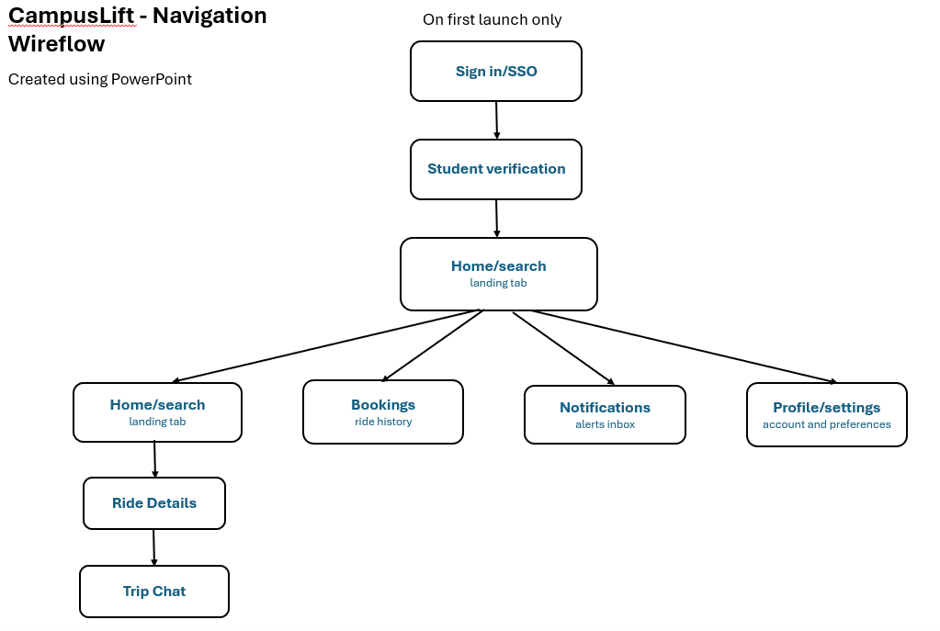

<p align="center">
  
</p>

<h1 align="center">CampusLift</h1>

<p align="center"><em>Safe. Affordable. Student Rides.</em></p>

A ride-sharing Android application built exclusively for university students. CampusLift connects verified students who need rides with fellow students who are already driving the same route — making transport cheaper, safer, and more sustainable for campus communities.

## Table of Contents

- [Overview](#overview)
- [Problem Statement](#problem-statement)
- [Features](#features)
- [Technology Stack](#technology-stack)
- [Architecture](#architecture)
- [Project Structure](#project-structure)
- [Setup Instructions](#setup-instructions)
- [API Endpoints](#api-endpoints)
- [Data Models](#data-models)
- [Screenshots](#screenshots)
- [Testing](#testing)
- [Version Control & CI/CD](#version-control--cicd)
- [Team & Contributions](#team--contributions)
- [Acknowledgements](#acknowledgements)
- [AI Usage Declaration](#ai-usage-declaration)
- [References](#references)
- [Demonstration Video](#demonstration-video)
- [License](#license)

## Overview

CampusLift is a native Android application that enables students to share rides within their campus community. The app requires university email verification to ensure safety and trust, offers a fixed cost-sharing model (no surge pricing), and provides real-time communication between drivers and passengers.

**Target Users:** University students who commute to campus — both those seeking rides and those willing to offer them.

## Problem Statement

Access to safe and reliable transportation is a challenge faced by many university students. Current options — expensive taxi services, inefficient public transport, and informal WhatsApp groups — are ineffective and sometimes unsafe.

CampusLift addresses this by providing an authenticated platform where verified university students can provide and request rides within their campus community, making travel cheaper, easier, and safer while also reducing car usage.

## Features

### Core Features (POE Part 1 & 2)

- **University Email Verification** — Only verified students can offer or book rides
- **Single Sign-On (SSO)** — Sign in with Google or Microsoft account via Firebase Authentication
- **Ride Matching** — Search for rides by pickup, destination, date, and time
- **Ride Creation** — Drivers can post rides with seat availability
- **Seat Booking** — Passengers can request seats with driver approval
- **Driver Ratings** — Post-trip rating system to build community trust
- **Trip Chat** — Private per-trip messaging between driver and passengers
- **Real-time Notifications** — Firebase Cloud Messaging for booking updates
- **Settings & Preferences** — Per-user settings with persistent storage
- **Offline Mode** — Local storage with automatic sync when reconnected

### Advanced Features (Final POE)

- **Biometric Authentication** — Fingerprint / face unlock
- **Multi-Language Support** — English and isiZulu
- **Live Location Sharing** — Share trip details with emergency contacts

## Technology Stack

### Android Application
| Component | Technology |
|-----------|-----------|
| Language | Kotlin |
| UI Framework | Jetpack Compose |
| Architecture | MVVM |
| Navigation | Navigation Compose |
| Networking | Retrofit + OkHttp |
| Local Storage | DataStore Preferences |
| Authentication | Firebase Auth + Credential Manager |
| Push Notifications | Firebase Cloud Messaging |
| Image Loading | Coil |
| Maps | Google Maps SDK |

### Backend
| Component | Technology |
|-----------|-----------|
| API Framework | ASP.NET Core Web API |
| Database | Supabase (PostgreSQL) |
| Hosting | Cloud-hosted |
| Authentication | Firebase + custom `X-Firebase-Uid` header |

## Architecture

CampusLift follows a client-server architecture with clear separation of concerns:

```
Android Application (Kotlin + Jetpack Compose)
        |
        | HTTPS / JSON
        | X-Firebase-Uid header
        v
CampusLift REST API (ASP.NET Core)
        |
        v
Supabase Database (PostgreSQL)

External Services:
- Firebase Auth (SSO)
- Firebase Cloud Messaging (Push)
- Google Maps SDK (Location)
```

### Architecture Diagram



The UML system architecture diagram from the Part 1 design document illustrates how the mobile application communicates with the custom REST API, database, and external SDKs.

## Project Structure

```
app/src/main/java/com/example/campuslift/
├── Auth/                      # Firebase authentication logic
├── Components/                # Reusable UI components
├── Data/                      # Data layer
│   ├── dto/                   # Data Transfer Objects
│   ├── remote/                # Network layer (Retrofit)
│   ├── repository/            # Repositories
│   └── SettingsRepository.kt  # DataStore-based settings storage
├── Navigation/                # Navigation graph
├── Screens/                   # UI Screens
├── ViewModels/                # MVVM ViewModels
├── ui/theme/                  # Theme & styling
└── MainActivity.kt            # App entry point
```

## Setup Instructions

### Prerequisites
- Android Studio (latest version)
- Android SDK API 25+
- JDK 11+
- Firebase project with Authentication enabled
- Access to the CampusLift backend API

### Steps

1. **Clone the repository:**
   ```bash
   git clone https://github.com/ST10441359/CampusLiftApp.git
   cd CampusLiftApp
   ```

2. **Open in Android Studio:**
   File → Open → select the `CampusLiftApp` folder

3. **Configure Firebase:**
   Place `google-services.json` in the `app/` folder and ensure your Firebase project has Google Sign-In enabled.

4. **Configure API URL:**
   Open `Data/remote/ApiConfig.kt` and set `BASE_URL` to your local or hosted API address.

5. **Build and run:**
   ```bash
   ./gradlew assembleDebug
   ```

## API Endpoints

### Users
| Method | Endpoint | Purpose |
|--------|----------|---------|
| POST | `/api/users/sync` | Sync Firebase user with backend |
| GET | `/api/users/me` | Get current user's profile |

### Vehicles
| Method | Endpoint | Purpose |
|--------|----------|---------|
| GET | `/api/vehicles` | List user's vehicles |
| POST | `/api/vehicles` | Register a new vehicle |
| PATCH | `/api/vehicles/{id}` | Update a vehicle |
| DELETE | `/api/vehicles/{id}` | Remove a vehicle |

### Trips
| Method | Endpoint | Purpose |
|--------|----------|---------|
| GET | `/api/trips` | Search for rides |
| GET | `/api/trips/mine` | Get rides created by current user |
| POST | `/api/trips` | Create a ride |
| PATCH | `/api/trips/{id}` | Update a ride |
| POST | `/api/trips/{id}/cancel` | Cancel a ride |
| POST | `/api/trips/{id}/complete` | Complete a ride |

### Bookings
| Method | Endpoint | Purpose |
|--------|----------|---------|
| POST | `/api/bookings` | Book a seat |
| GET | `/api/bookings/mine` | List user's bookings |
| POST | `/api/bookings/{id}/approve` | Approve a booking |
| POST | `/api/bookings/{id}/cancel` | Cancel a booking |
| POST | `/api/bookings/{id}/pickup-confirm` | Confirm pickup |

### Notifications
| Method | Endpoint | Purpose |
|--------|----------|---------|
| GET | `/api/notifications` | List notifications |
| GET | `/api/notifications/unread-count` | Get unread count |
| PATCH | `/api/notifications/{id}` | Mark as read |
| POST | `/api/notifications/mark-all-read` | Mark all read |

## Data Models

### UserDto
```kotlin
data class UserDto(
    val id: String,
    val firebaseUid: String?,
    val email: String?,
    val name: String?,
    val surname: String?,
    val studentNumber: String?,
    val university: String?,
    val isVerified: Boolean?,
    val profilePicture: String?,
    val emergencyContact: String?,
    val language: String?,
    val darkMode: Boolean?,
    val biometricEnabled: Boolean?,
    val notificationEnabled: Boolean?
)
```

Full models are located in `Data/dto/`.

## Screenshots

*Screenshots will be added once the UI is finalised. Screens to capture:*

- Login / SSO screen
- Home / Search screen
- Ride Details screen
- Bookings screen
- Profile / Settings screen (light mode)
- Profile / Settings screen (dark mode)
- Alerts / Notifications screen

## Testing

The project includes unit tests for reusable logic components, executed automatically via GitHub Actions on every push.

### Unit Tests

**Validation logic** (`ValidationUtilsTest.kt`):
- Phone number validation
- Email validation
- Required field validation
- Max length validation

### Running Tests Locally

```bash
./gradlew test
```

### Automated Testing

Tests run automatically on every push via GitHub Actions. See the [Actions tab](https://github.com/ST10441359/CampusLiftApp/actions) for live results.

## Version Control & CI/CD

### Version Control

This project uses Git with a feature-branch workflow:
- `main` — stable, deployable branch
- Feature branches merged via pull requests
- Regular commits with descriptive messages

### Commit Convention

```
feat: add new feature
fix: resolve bug
docs: update documentation
test: add tests
ci: update CI configuration
```

### GitHub Actions

*Workflow configuration and CI/CD setup will be finalised by the team. This section will document:*
- Workflow file name and location
- Trigger conditions (push to main, pull requests)
- Jobs performed (build, test, lint)
- Link to live workflow results

## Team & Contributions

**Group: Commit Push & Pray**

| Member | Student Number | Primary Responsibility |
|--------|---------------|----------------------|
| Suvan Samlall | ST10441359 | Group Leader, SSO, API Integration, GitHub Actions |
| Joshua Gerald Chetty | ST10296234 | REST API, Database, Backend Business Logic |
| Ziyaad Simjee | ST10406906 | Core Ride Features & Feature UI |
| Keshvir Parthab | ST10451537 | Settings, Reusable Components, Validation, Tests |

### Suvan Samlall — SSO & API Integration

Suvan led the project as group leader and was responsible for the full authentication and API integration layer. He implemented the Single Sign-On flow using Google Credential Manager with Firebase Authentication, enabling students to sign in with their university Google accounts. He built the Retrofit-based networking layer (`RetrofitClient`, `ApiService`, `AuthInterceptor`) that handles all communication between the Android app and the ASP.NET Core backend, using the `X-Firebase-Uid` header to authenticate requests. Suvan also built the `SyncObserver` in `MainActivity` that automatically syncs the signed-in Firebase user with the Supabase database after login. He set up and coordinated the GitHub repository, branch strategy, and CI/CD workflows.

### Joshua Gerald Chetty — Backend & Database

Joshua was responsible for the ASP.NET Core REST API and Supabase (PostgreSQL) database that power CampusLift. He designed and implemented the full backend architecture including user management, vehicle registration, trip listings, bookings, notifications, and business logic such as seat availability checks and duplicate booking prevention. He created all Data Transfer Objects (`UserDto`, `TripDto`, `BookingDto`, `NotificationDto`, `VehicleDto`, `PublicSummaryDto`) that define the API contract and are consumed by the Android client. Joshua also handled API hosting and tested every endpoint to ensure reliable communication with the mobile app.

### Ziyaad Simjee — Core Ride Features & Feature UI

Ziyaad built the core ride-sharing user experience of CampusLift. He implemented the ride creation screen (`CreateRideScreen`) where drivers post rides with pickup location, destination, date, time, price, and available seats. He built the home search screen (`HomeScreen`) with filtering by date and location, and the ride details screen (`RideDetailsScreen`) where passengers can view driver information, vehicle details, and request seats. He also implemented `MyBookingsScreen`, `LiftDetailsScreen`, `LiftsScreen`, `BookingDetailsScreen`, `AddVehicleScreen`, and `AlertsScreen` — plus the supporting components `BookingCard`, `ActiveTripBanner`, and `PassiveBanner`. Together these screens form the complete ride-sharing workflow: searching, booking, tracking, and completing trips.

### Keshvir Parthab — Settings, Reusable Components, Validation

Keshvir built the Settings/Profile screen with per-user preferences, and created the reusable UI component library used across all screens. His work includes the account overview section, language dropdown (English / isiZulu), Dark Mode toggle wired to the app theme, Biometric Login toggle, Notifications toggle, editable default pickup and emergency contact fields, and Save button with Toast confirmation. He implemented per-user settings persistence using Android DataStore, with all preferences keyed by Firebase UID so each user has their own settings. He created 14 reusable components in the `Components/` package used by every screen in the app, and the `ValidationUtils` helper class for form validation.

### Shared Contributions

All team members contributed to the UI design consistency across the app and to the testing of features on physical devices. Suvan, Joshua, Ziyaad, and Keshvir all participated in the competitive research, design planning (Part 1), and prototype testing phases of the project.

## Acknowledgements

CampusLift was built using the following open-source libraries and public documentation:

- **Jetpack Compose** — Android UI toolkit (Apache 2.0)
- **Retrofit** — Networking library by Square (Apache 2.0)
- **OkHttp** — HTTP client by Square (Apache 2.0)
- **Firebase** — Authentication and Cloud Messaging by Google
- **DataStore** — Preferences storage by Android
- **Material Design 3** — Design system by Google
- **ASP.NET Core** — Backend framework by Microsoft
- **Supabase** — PostgreSQL database hosting
- **Gson** — JSON serialization by Google

## AI Usage Declaration

Generative AI tools (ChatGPT, Google Gemini) were used during development of CampusLift for:

- Debugging assistance and error resolution
- Code structure suggestions and boilerplate generation
- Documentation drafting and refinement

All AI-generated content was reviewed, adapted, and integrated by team members. Any code snippets or patterns adapted from external sources are referenced in the References section.

## References

The following resources were consulted and used during the development of CampusLift. All sources are referenced using the IEEE style.

### Android & Jetpack Compose

[1] Android Developers, "Jetpack Compose," [Online]. Available: https://developer.android.com/jetpack/compose. [Accessed: Sep. 2026].

[2] Android Developers, "Guide to app architecture - MVVM," [Online]. Available: https://developer.android.com/topic/architecture. [Accessed: Sep. 2026].

[3] Android Developers, "DataStore," [Online]. Available: https://developer.android.com/topic/libraries/architecture/datastore. [Accessed: Sep. 2026].

[4] Android Developers, "Biometric authentication," [Online]. Available: https://developer.android.com/training/sign-in/biometric-auth. [Accessed: Sep. 2026].

[5] Android Developers, "Navigation Compose," [Online]. Available: https://developer.android.com/develop/ui/compose/navigation. [Accessed: Sep. 2026].

[6] Android Developers, "Material 3 in Compose," [Online]. Available: https://developer.android.com/develop/ui/compose/designsystems/material3. [Accessed: Sep. 2026].

### Firebase

[7] Firebase, "Firebase Authentication for Android," [Online]. Available: https://firebase.google.com/docs/auth/android/start. [Accessed: Sep. 2026].

[8] Firebase, "Firebase Cloud Messaging," [Online]. Available: https://firebase.google.com/docs/cloud-messaging. [Accessed: Sep. 2026].

[9] Google, "Sign in with Google for Android using Credential Manager," [Online]. Available: https://developer.android.com/identity/sign-in/credential-manager-siwg. [Accessed: Sep. 2026].

### Networking & Data

[10] Square, "Retrofit - A type-safe HTTP client for Android," [Online]. Available: https://square.github.io/retrofit/. [Accessed: Sep. 2026].

[11] Square, "OkHttp," [Online]. Available: https://square.github.io/okhttp/. [Accessed: Sep. 2026].

[12] Google, "Gson," [Online]. Available: https://github.com/google/gson. [Accessed: Sep. 2026].

### Backend

[13] Microsoft, "ASP.NET Core Web API Documentation," [Online]. Available: https://learn.microsoft.com/en-us/aspnet/core/web-api/. [Accessed: Sep. 2026].

[14] Supabase, "Supabase Documentation," [Online]. Available: https://supabase.com/docs. [Accessed: Sep. 2026].

### Tools & DevOps

[15] GitHub, "GitHub Actions Documentation," [Online]. Available: https://docs.github.com/en/actions. [Accessed: Sep. 2026].

[16] JetBrains, "Kotlin Documentation," [Online]. Available: https://kotlinlang.org/docs/. [Accessed: Sep. 2026].

## Demonstration Video

**Video link:** *To be added - unlisted YouTube URL.*

The demonstration video will cover:
- SSO registration and login
- Settings menu with working toggles
- Offline mode with sync
- Real-time notifications
- Core user-defined features
- Live demonstration on a physical Android device

## License

This project is developed as part of the IIE Bachelor of Computer and Information Sciences module PROG7314 - Programming 3D. It is for academic purposes only.

*Last updated: September 2026*
